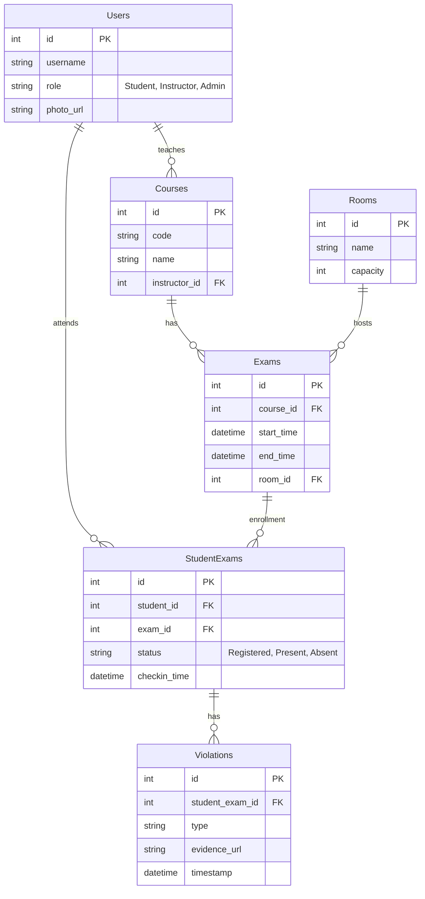
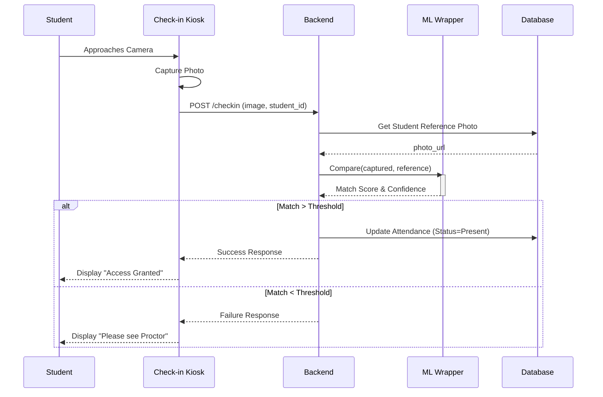
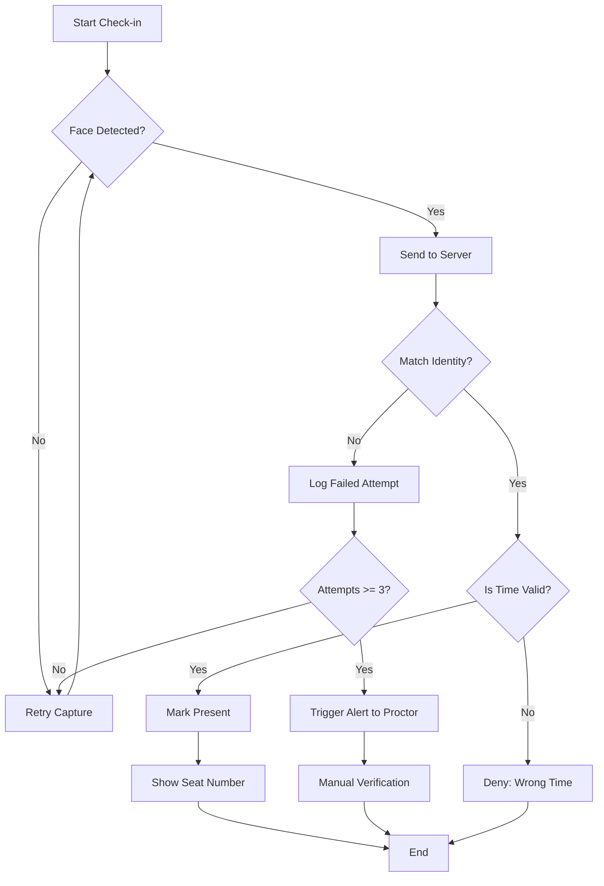

# System Diagrams

## Use Case Diagram

```mermaid
usecaseDiagram
    actor Student
    actor Instructor
    actor Proctor
    actor Admin

    package "Exam Security System" {
        usecase "Login" as UC1
        usecase "View Exam Schedule" as UC2
        usecase "Check-in (Face Rec.)" as UC3
        usecase "Create Exam" as UC4
        usecase "Upload Seating Plan" as UC5
        usecase "Monitor Exam" as UC6
        usecase "Report Violation" as UC7
        usecase "View Reports" as UC8
    }

    Student --> UC1
    Student --> UC2
    Student --> UC3

    Instructor --> UC1
    Instructor --> UC4
    Instructor --> UC5
    Instructor --> UC8

    Proctor --> UC1
    Proctor --> UC3
    Proctor --> UC6
    Proctor --> UC7

    Admin --> UC1
    Admin --> UC8
```

## ER Diagram



## Sequence Diagram (Check-in)



## Activity Diagram (Decision Flow)


